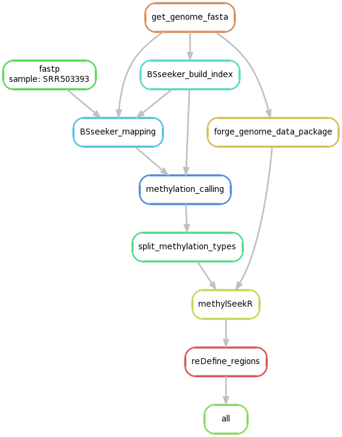

# Snakemake_plant_methylSeekR
Snakemake pipeline for analysis of bisulfite-seq data

# Aim

Snakemake pipeline made for reproducible analysis of paired-end Illumina bisulfite-seq data
Mapping and methylation calling is done with the tool [BSseeker2](https://guoweilong.github.io/BS_Seeker2/index.html)
Identification of regions of low or no methylation is based on [MethylSeekR](https://bioconductor.org/packages/release/bioc/html/MethylSeekR.html) With some added features to make it more suitable for plant samples.

# Content of the repository

- **Snakefile**, containing the targeted output and the rules to generate them from the input files.

- **Fastq/**, folder containing subsetted paired-end fastq files used to test locally the pipeline.

- **genome/**, folder containing a small fragment of chromosome 12 of the tomato genome, to be used for the local test.

- **envs/**, folder containing the environments needed for the Snakefile to run. To use Snakemake, it is required to create and activate an environment containing snakemake (here : envs/global_env.yaml )

- **samples.tsv**, is a tab separated value file containing information about the used samplesnames (name of used species,tissue,...) and the path to the fastq files relative to the **Snakefile**. **Change this file according to your samples.**

# Usage

## Conda environment

First, you need to create an environment for the use of Snakemake with [Conda package manager](https://conda.io/docs/using/envs.html).
1. Create a virtual environment named "atacseq" from the `global_env.yaml` file with the following command: `conda env create --name BSanalysis --file ~/envs/global_env.yaml`
2. Then, activate this virtual environment with `conda activate BSanalysis`

The Snakefile will then take care of installing and loading the packages and softwares required by each step of the pipeline.

## Configuration file
The `~/configs.yaml` file specifies the sample list (sample.tsv), the genomic reference fasta file to use, the directories to use, etc. This file is then used to build parameters in the main `Snakefile`.

## Snakemake execution
The Snakemake pipeline/workflow management system reads a master file (often called `Snakefile`) to list the steps to be executed and defining their order.
It has many rich features. Read more [here](https://snakemake.readthedocs.io/en/stable/).

## Samples
Samples are listed in the `samples.tsv` file and will be used by the Snakefile automatically. Change the name accordingly.

## Dry run
Use the command `snakemake -np` to perform a dry run that prints out the rules and commands.

## Real run
Simply type `Snakemake --use-conda` and provide the number of cores with `--cores 10` for ten cores for instance.
For cluster execution, please refer to the [Snakemake reference](https://snakemake.readthedocs.io/en/stable/executable.html#cluster-execution).
Please pay attention to `--use-conda`, it is required for the installation and loading of the dependencies used by the rules of the pipeline.

# Main outputs
- **bed files** containing the unmethylated (UMR) and low methylated (LMR) regions.
- **log files** containing reports of the fastP, BSseeker2 and methylcalling steps.

# Parameters

The setting as given, is optimized to plant samples.

# Directed Acyclic Graph of jobs

